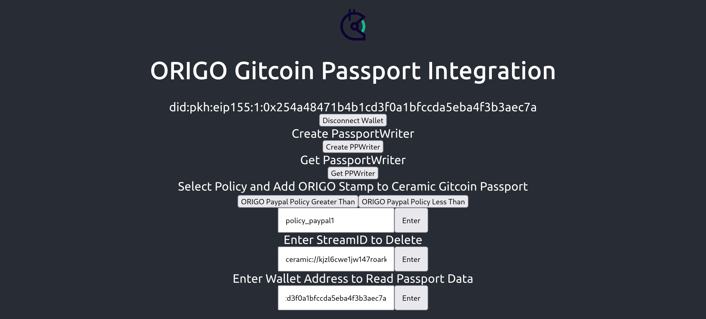

## Tutorial 03: Connecting ORIGO to Gitcoin Passport

#### Step 0: (optional but important to know) Building custom gitcoin passport SDK
Due to import errors of the default gitcoin passport SDK writer [package](https://github.com/gitcoinco/passport-sdk/tree/main/packages/writer), we built a custom package with the functionality of the gitcoin passport writer SDK. Before importing the custom module, jump into the `dependencies/gitcoin_sdk/` folder and execute `npm install` which outputs a `node_modules` folder. Our gitcoin sdk writer module can be found under the path `dependencies/gitcoin_sdk/working_writer`. In order to build our working gitcoin passport SDK, jump into the `working_writer` folder and execute `yarn install` which produces a `dist` folder inside `working_writer`. Remove all files inside the folder `dependencies/gitcoin_sdk/node_modules/@gitcoinco/passport-sdk-writer/`. Now, copy the `dist` folder and the `package.json` file from `dependencies/gitcoin_sdk/working_writer` into `dependencies/gitcoin_sdk/node_modules/@gitcoinco/passport-sdk-writer/`. Now you can jump into the folder `dependencies/gitcoin_sdk/` and execute the command `npm run build` which outputs a `build` folder in the same location. The `build` folder contains the frontend which we serve with a local server program inside the `prover/gitcoin_server` folder. Thus, copy the `dependencies/gitcoin_sdk/build` folder into `prover/gitcoin_server/frontend/`. Now you can start out local prover gitcoin instance by jumping into `prover/gitcoin_server/` and executing either `go run main.go` or simply `./main`. Now go to `http://localhost:8080` and check use our gitcoin passport integration via a convenient frontend.

#### Step 1: Starting our gitcoin passport ORIGO integration
We provide a sample frontend of our gitcoin passport toolkit in the `prover/gitcoin_server/frontend/build` folder, which makes running step 0 obsolete. To start the _ORIGO_ gitcoin passport integration use case, jump into the folder `prover/gitcoin_server/` and execute `./main` or `go run main.go`. Next use your browser and visit `http://localhost:8080`. You should see the frontend similar to the screenshot provided above.

#### Step 2: Connecting your MetaMask Wallet
Make sure you have your MetaMask wallet add on added to and enabled in your browser. In the frontend of _ORIGO_ gitcoin passport, click the button at the top called `connect wallet` and follow the steps inside MetaMask to sign and provide your local _ORIGO_ gitcoin passport app access to your address.

#### Steo 3: Create a Gitcoin Passport on Ceramic Network
Next, click the button `Create PPWriter` to create an gitcoin passport with your MetaMask address wrapped as a DID on the [ceramic network](https://developers.ceramic.network/learn/welcome/). This step takes a couple of seconds. Please check your console in your browsers devtools to see our output which indicates that your Ceramic StreamID has been created. Now you can click the button `Get PPWriter` to see your account details inside the browsers devtools console. You can also copy your wallet address into the text input field below the tag `Enter Wallet Address to Read Passport Data` so see your passport details.

#### Step 4: Create a W3C Verifiable Credential provided by ORIGO which includes a zero-knowledge Proof of PayPal Balance Threshold Compliance and add the Credential to Gitcoin Passport as a Stamp.
Next click on one of our sample _ORIGO_ policies provided by the buttons `ORIGO Paypal Policy Greater Than` or `ORIGO Paypal Policy Less Than`. Once you've clicked on one of these buttons, a modal opens up displaying the policy in json. Copy the policy name (either `policy_paypal1` or `policy_paypal2`) provided in the modal headline and paste it into the text input field under the tag `Select Policy and Add ORIGO Stamp to Ceramic Gitcoin Passport` and hit the `Enter` button. What happens next is that the frontend sends a post request to the `prover/gitcoin_server`. The prover backend program (`prover/gitcoin_server`) refreshes paypal credentials, transpiles the selected policy, requests data from the API through the _ORIGO_ proxy, and proves data provenance of a policy compliant paypal API balance. If the procedure is successfull, the gitcoin server running locally on your computer, passes a signed JWT and the W3C Verifiable Credential back to the frontend running in your browser. The frontend now sends another signed POST request to Ceramic Network adding the Credential to your streamID in form of a stamp. You can see a sample stamp added to our Ceramic streamID [here](https://tiles.ceramic.community/document/kjzl6cwe1jw146d6kz25agf227qml4i1na5iyrtey1pmrkce4vw82pvpy3qf1z0).

#### Step 5: Deleting a Credential Stamp from your Gitcoin Passport Stream
You can delete a stamp by connecting your wallet, clicking the button `GetPPWriter` and reading the respective StreamID you want to delete from the logs in the browser devtools console, and pasting that ceramic streamID into the text input field under the tag `Enter StreamID to Delete` and hitting the button `Enter`. The next time you request your gitcoin passport via `GetPPWriter`, you will see the streamID stamp array with one item less.

Congratulations, you mastered our third tutorial.

